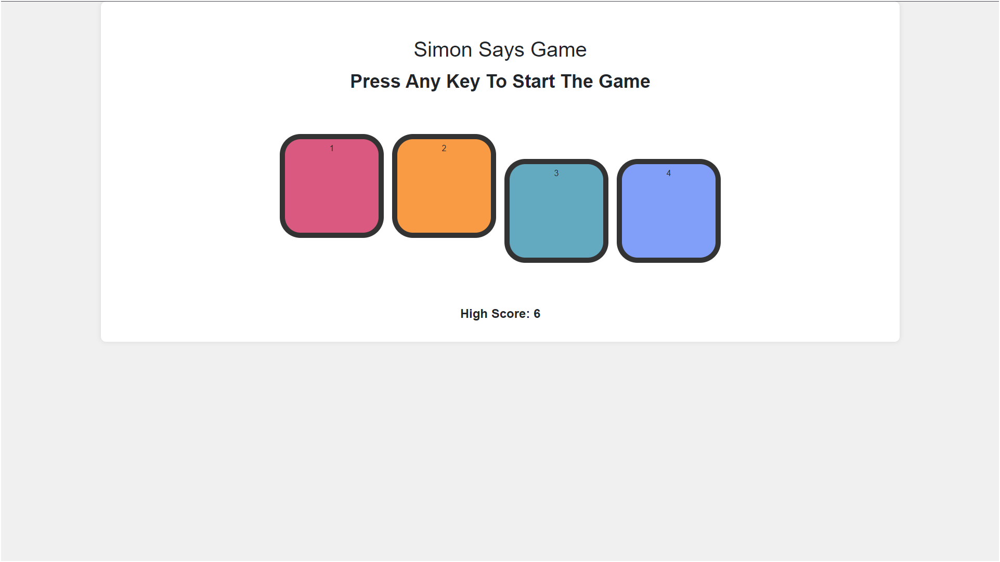

**Simon Says Game**
================

A classic memory game where you must repeat the sequence of colors shown by Simon. Can you keep up?

**Game Rules**
-------------

1. **Simon's Turn**: The game starts with Simon showing a sequence of colors (red, blue, green, and yellow) in a random order.
2. **Your Turn**: Your task is to repeat the sequence of colors by clicking on the corresponding colored buttons.
3. **Adding Complexity**: After each round, Simon adds one more color to the sequence, making it increasingly difficult to remember.
4. **Mistakes**: If you make a mistake, the game ends, and you start over.
5. **Winning**: The game continues until you reach a predetermined number of rounds (e.g., 10).

**How to Play**
--------------

1. Open the game in your web browser.
2. Wait for Simon to show the initial sequence of colors.
3. Click on the colored buttons to repeat the sequence.
4. Keep repeating the sequence as Simon adds more colors.
5. Try to beat your high score!

**Features**
------------

* Simple and intuitive gameplay
* Increasing difficulty as the game progresses
* Responsive design for a smooth user experience
* High score tracking 

**Technical Details**
--------------------

* Built with HTML, CSS, and JavaScript
* Compatible with modern web browsers

**Contributing**
---------------

Feel free to contribute to this project by:

* Reporting bugs or issues
* Suggesting new features or improvements
* Submitting pull requests with your changes

**License**
-------

This project is licensed under the [insert license, e.g., MIT License].

